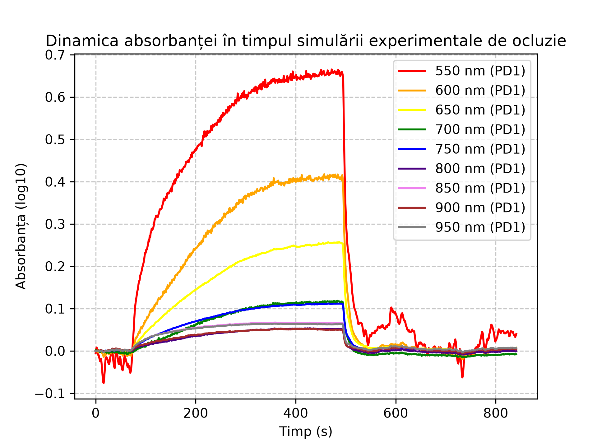
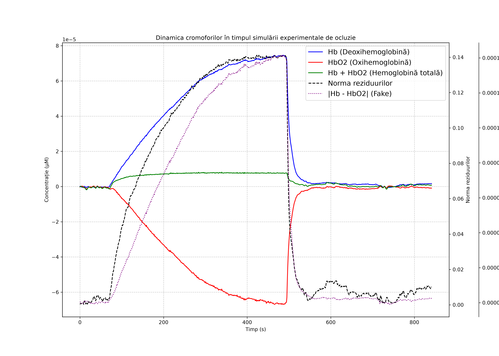
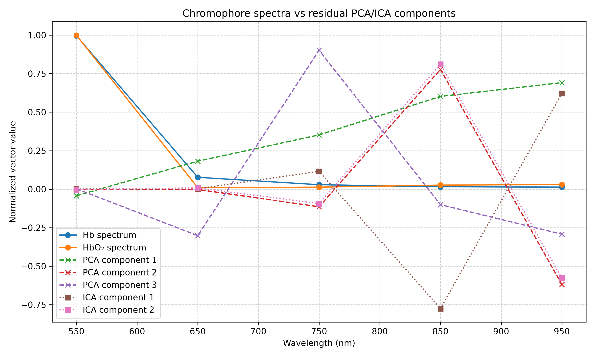

# Flapometer - Data Analysis Demo

## Overview

This notebook demonstrates a spectrophotometric data analysis pipeline for data obtained using the **Flapometer device, a prototype optical device** for continuous monitoring of tissue perfusion. The device sensors consist of 9 LEDs of different wavelengths and 4 Photodiodes. Because oxygenated and deoxygenated hemoglobin have different absorbtion characteristics, the measurements can be used to estimate tissue perfusion. Example data are provided in the repo. Click here for notebook: **[flapometer_analysis_demo.ipynb](spectrophotometry/flapometer_analysis_demo.ipynb)**

## Data acquisition software

The data acquisition software is available here: https://github.com/andan42/flapometer-data-acquisition Hardware design (schematics and boards) not yet available.

## Author

The software was developed and implemented by me from the ground up, along with the hardware and data acquisition software, as part of my M.D. thesis at the University of Medicine and Pharmacy "Carol Davila", Bucharest.

## Info

- Two example recordings are included, one is anonymized, the other is me.
- Plots at the end!
- PCA and ICA analysis are used with the intent of further refining the model
- Parameters of the pipeline can be changed in the notebook. See each section for details.

## Basic principles
- Each of the 18 data channels contains intensity recordings of tissue transmitted light in 9 different wavelengths (550nm - 950nm).
- Light intensities are referenced to a baseline established at the beginning of the recording.
- According to Beer-Lambert law (I = I<sub>0</sub>e<sup>-ax</sup> where I - intensity, a - attenuation coefficient, x - distance) absorbance can be computed as logarithm of measured intensity.
- The overdetermined linear system $\mathbf{M}\mathbf{c}=\mathbf{A}$ (where $\mathbf{M}$ absorbance matrix, $\mathbf{c}$ unknown chromophore concentrations, $\mathbf{A}$ vector of measured absorbances.) gives the relationship between concentrations (vector $\mathbf{c}$) and attenuation coefficients (vector $\mathbf{A}$)
- Find best fit solution of $\mathbf{M}\mathbf{c}=\mathbf{A}$ to approximate concentrations
- Deviations from best fit concentrations are analyzed with PCA and ICA

## Example output
During this experiment venous occlusion is achieved by using a blood pressure cuff at low pressure for a few minutes. Note the increase in Deoxyhemolgobin concentration as Oxyhemoglobin decreases. The demo notebook also contains an example of arterial occlusion.







## How to run
### Requires
- Git
- Python 3 
with the following packages:
- numpy
- matplotlib
- scikit-learn
- jupyter
### Clone
```sh
git clone https://github.com/andan42/flapometer-data-analysis.git
cd flapometer-data-analysis
```
### Create venv
Linux
```sh
python -m venv .venv
source .venv/bin/activate
```
Windows
```sh
python -m venv .venv .venv\Scripts\Activate.ps1
```
### Install packages
```sh
pip install numpy matplotlib scikit-learn jupyter
```
### Launch
Either open project with VS Code or run ```sh jupyter notebook``` after activating venv.